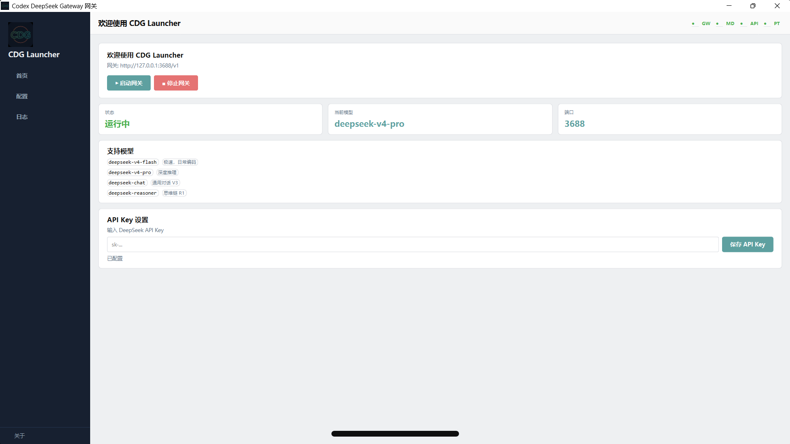

# Codex DeepSeek Gateway

```
Codex Desktop  ->  http://127.0.0.1:3688/v1  ->  Gateway  ->  DeepSeek API
```

Local compatibility gateway that translates Codex Responses API to DeepSeek Chat Completions, enabling Codex to use DeepSeek models without modifying Codex itself.

> **IMPORTANT: You must configure `.codex\config.toml` for Codex to use this gateway!**
>
> After starting the gateway, Codex Desktop will NOT automatically connect:
> 1. Copy `codex\config.toml.example` -> `%USERPROFILE%\.codex\config.toml`
> 2. Run `.\scripts\apply_codex_all.ps1` to sync configuration
> 3. **Restart Codex Desktop**

## Quick Start

### Option 1: Download Pre-built EXE (Recommended)

Go to [GitHub Releases](https://github.com/wodengnisinian/codex-deepseek-gateway/releases) and download the latest `CDG Launcher.exe`:

1. Download `CDG Launcher.exe` (single file, no installation, no Python required)
2. Double-click to run
3. Enter your DeepSeek API Key (get it from https://platform.deepseek.com)
4. Select a model, click Start Gateway
5. Default gateway address: `http://127.0.0.1:3688/v1`

### Option 2: Run from Source

```powershell
cd codex-deepseek-gateway
[Environment]::SetEnvironmentVariable("DEEPSEEK_API_KEY", "sk-your-key", "User")
pip install -r requirements.txt
python scripts/launcher_pyside6.py
```

> **v1.0.1 Note**: `scripts/run_proxy.ps1` has been removed. The gateway now starts via embedded uvicorn in a background QThread with zero cmd/powershell popup windows.
### Plugin Compatibility Mode

To keep OpenAI login state in Codex Desktop while using plugins, set two additional environment variables:

```powershell
[Environment]::SetEnvironmentVariable("GATEWAY_AUTH_TOKEN", "local-gateway-token", "User")
[Environment]::SetEnvironmentVariable("GATEWAY_MODEL_PROVIDER", "deepseek_gateway_plugin_mode", "User")
```

Then uncomment "Mode 2" and comment out "Mode 1" in `codex/config.toml`, and run:

```powershell
.\scripts\apply_codex_all.ps1
```

Restart Codex.

## Configure Codex

After the gateway starts, write configuration to Codex Desktop config directory.

### Steps

```powershell
cd codex-deepseek-gateway
copy codex\config.toml.example %USERPROFILE%\.codex\config.toml
.\scripts\apply_codex_all.ps1
# Restart Codex Desktop
```

### Manual Configuration

If not using the sync script, manually edit `%USERPROFILE%\.codex\config.toml`:

```toml
model_provider = "deepseek_gateway"
model = "deepseek-v4-flash"
model_reasoning_effort = "high"

[model_providers.deepseek_gateway]
name = "DeepSeek Gateway"
base_url = "http://127.0.0.1:3688/v1"
wire_api = "responses"
env_key = "DEEPSEEK_API_KEY"
models = ["deepseek-v4-flash", "deepseek-v4-pro", "deepseek-chat", "deepseek-reasoner"]
```

> See `codex/config.toml.example.full` for detailed configuration.

### Verify Configuration

1. Start gateway, confirm `curl http://127.0.0.1:3688/health` returns `{"status":"ok"}`
2. Restart Codex Desktop
3. Send a message in Codex, observe gateway logs for requests

### FAQ

- **Codex not using gateway**: Check `%USERPROFILE%\.codex\config.toml` exists and is correct
- **401 error**: Ensure `DEEPSEEK_API_KEY` is set to a valid DeepSeek API Key
- **Connection refused**: Confirm gateway is running and port 3688 is not in use
- **Windows popup windows**: v1.0.1 completely eliminates cmd/powershell popups
## Project Structure

```
server.py                   # FastAPI gateway main program
adapters/
  chat_to_responses.py       # Chat Completions -> Responses API
  responses_to_chat.py       # Responses API -> Chat Completions
  tools_adapter.py           # Codex plugin tool protocol adaptation
tests/
  test_adapters.py           # Adapter unit tests
  test_server.py             # Server tests
codex/
  config.toml                # Local config template (gitignored)
  config.toml.example        # Config example (both modes in one file)
  config.toml.example.full   # Fully commented config example
  model_catalog.json         # Model catalog
  skills/                    # Local skill files
scripts/
  launcher_pyside6.py        # PySide6 desktop launcher (main entry)
  apply_codex_all.ps1        # Sync config to %USERPROFILE%\.codex
  test_*.ps1                 # Integration test scripts
```

## Endpoints

| Method | Path | Description |
|--------|------|-------------|
| GET | `/health` | Health check |
| GET | `/v1/models` | Model list (from `codex/model_catalog.json`) |
| POST | `/v1/responses` | Responses -> Chat Completions conversion |

## Environment Variables

| Variable | Required | Description |
|----------|----------|-------------|
| `DEEPSEEK_API_KEY` | Yes | DeepSeek API Key |
| `DEEPSEEK_BASE_URL` | No | DeepSeek API URL, default `https://api.deepseek.com` |
| `DEFAULT_MODEL` | No | Default model, default `deepseek-v4-flash` |
| `PROXY_PORT` | No | Gateway port, default `3688` |
| `GATEWAY_AUTH_TOKEN` | No | Local auth token (plugin compatibility) |
| `GATEWAY_MODEL_PROVIDER` | No | Override `/v1/models` `owned_by` field |
| `DEEPSEEK_THINKING` | No | Reasoning toggle: `enabled` / `disabled` |
| `DEEPSEEK_REASONING_EFFORT` | No | Reasoning depth: `low`/`medium`/`high`/`max` |

## Tool Call Flow

```
1. Codex sends /v1/responses (with tools)
2. Gateway converts Responses tools to Chat Completions tools
3. DeepSeek returns tool_calls
4. Gateway converts to Responses function_call items
5. Codex locally executes tool, sends function_call_output
6. Gateway converts to role=tool Chat messages
7. DeepSeek returns final text
```
## Tool Protocol Mapping

| Codex Tool Type | DeepSeek Encoding | Decode Back |
|-----------------|-------------------|-------------|
| `function` | Original function name | `function_call` |
| `namespace` | `cx_*__*` alias | `function_call` + namespace |
| `tool_search` | `tool_search` | `tool_search_call` |
| `custom` | `custom__*` alias | `custom_tool_call` |

## Cache Strategy

The gateway only inserts the tool protocol hint when Codex sends plugin tools (namespace/tool_search/custom), and **merges it into the first system message** to avoid fragmenting DeepSeek 128-token cache blocks.

| Thread Type | Prefix Consistency | Expected Hit Rate |
|-------------|-------------------|-------------------|
| Coding thread (with tools) | Same-thread hint + instructions unchanged | 98%+ |
| Chat thread (no tools) | Same-thread instructions unchanged | 98%+ |
| New thread first request | Guaranteed miss | 0% |

## Testing

```powershell
# Unit tests (no network required)
python -m unittest discover -s tests

# Integration tests (gateway must be running)
.\scripts\test_health.ps1
.\scripts\test_models.ps1
.\scripts\test_response.ps1
.\scripts\test_stream_response.ps1
.\scripts\test_tool_call.ps1
.\scripts\test_stream_tool_call.ps1
```

## Screenshot



## v1.0.1 Changelog (2026-06-24)

### Fixed

- **Windows no-console**: Completely eliminated powershell.exe / cmd.exe popup windows
  - Replaced `subprocess.run(["powershell", ...])` with `winreg` for API key management
  - Replaced powershell-based port-kill with ctypes `GetExtendedTcpTable` + `TerminateProcess`
  - Removed `QProcess`, `LogReader`, `_gw_proc`, `find_run_script()` legacy code
  - Gateway now starts via embedded `uvicorn.Server` in a QThread (no external process)
- **Anti-duplicate-start guards**: Added `_is_starting`, `_last_start_time`, `_start_debounce_sec`
- **Port occupation check**: Socket-based `_is_port_listening()` before gateway start
- **Health-check QTimer**: Only refreshes UI status; does not auto-restart gateway
- **PyInstaller**: Enforced `--noconsole --windowed` and `console=False` in spec
## Versioning

This project has separate **source versions** and **software versions**:

### Source Version (Git Tag)

The source repo uses Git Tags to mark versions. Each Release corresponds to a tag (e.g. `v1.0.1`).

```powershell
git clone https://github.com/wodengnisinian/codex-deepseek-gateway.git
git checkout v1.0.1
# Or download ZIP:
# https://github.com/wodengnisinian/codex-deepseek-gateway/archive/refs/tags/v1.0.1.zip
```

### Software Version (GitHub Release)

Software versions are packaged `CDG Launcher.exe` files, published on [GitHub Releases](https://github.com/wodengnisinian/codex-deepseek-gateway/releases).

To update: go to the Releases page, download the latest `CDG Launcher.exe`, and replace the old file.

### Version Table

| Version | Type | Description |
|---------|------|-------------|
| `v1.0.1` | Source + Software | Fixed Windows cmd/powershell popups, added anti-duplicate-start protection |
| `v1.0.0` | Source + Software | Initial release |
| main branch | Source | Latest development code, may be unstable |

### Tech Stack

| Component | Version |
|-----------|---------|
| Python | 3.11+ |
| FastAPI | 0.115.6 |
| uvicorn | 0.34.0 |
| httpx | 0.28.1 |
| PySide6 | 6.x |
| PyInstaller | 6.x |

## License

MIT

---

## Author

- [wodengnisinian](https://github.com/wodengnisinian)